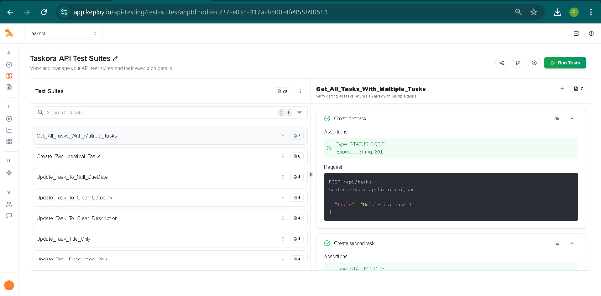

# 📝 Personal Task Manager

A full-stack Task Manager app with:

- ⚙️ **Backend:** Node.js, Express, MongoDB
- 🎨 **Frontend:** React (Vite), Tailwind CSS
- 🌗 **Dark Mode UI:** High-contrast, accessible interface
- 📦 RESTful APIs for managing personal tasks

---

## 📁 Project Structure
```
taskmanager/
├── task-backend/     # Express + MongoDB backend
└── task-frontend/    # React + Tailwind CSS frontend
 ``` 
## 🚀 Setup Instructions

### 1️⃣ Clone the Repository

```bash
git clone https://github.com/your-username/taskmanager.git
cd taskmanager
```
###  2️⃣ Backend Setup
```
cd task-backend
npm install
```
🔐 Create a .env file with your MongoDB URI:
```
MONGO_URI=mongodb://localhost:27017/taskdb
PORT=5000
```
▶️ Start the backend server:
```
npm app.js
```
### 3️⃣ Frontend Setup
```
cd ../task-frontend
npm install
npm run dev
```
Ensure your api.js points to the backend:
```
export const API = axios.create({
  baseURL: 'http://localhost:5000/api/tasks'
});
```
## 📚API Documentation
### 📌 Base URL:
```
http://localhost:5000/api/tasks
```
### 🔹 1. Get All Tasks

- **Endpoint:** `GET /api/tasks`  
- **Description:** Fetch all tasks from the database.  
- **Request Body:** None  

**Sample Response:**
```json
[
  {
    "_id": "662a9d6fe4739f0012a4e8cc",
    "title": "Learn MongoDB",
    "description": "Focus on Mongoose schemas",
    "priority": "high",
    "category": "Study",
    "dueDate": "2025-06-25T00:00:00.000Z",
    "isCompleted": false
  }
]
```
### 🔹 2. Add a New Task
- **Endpoint:** `POST /api/tasks`
- **Description:** Create a new task.
  
 **Request Body:**
  ```
  {
  "title": "Buy groceries",
  "description": "Milk, eggs, bread",
  "priority": "medium",
  "category": "Personal",
  "dueDate": "2025-06-20"
}
```
 **Sample Response:**
```
{
  "_id": "662ab123aefbc12bb23fd7a3",
  "title": "Buy groceries",
  "description": "Milk, eggs, bread",
  "priority": "medium",
  "category": "Personal",
  "dueDate": "2025-06-20T00:00:00.000Z",
  "isCompleted": false
}
```
### 🔹 3. Update a Task
- **Endpoint:** `PUT /api/tasks/:id`
- **Description:** Update a task by its ID.
  
**Request Body:**
  ```
  {
  "title": "Buy groceries and snacks",
  "isCompleted": true
}
```
**Sample Response:**
```
{
  "message": "Task updated successfully."
}
```
### 🔹 4. Delete a Task
- **Endpoint:** `DELETE /api/tasks/:id`
- **Description:** Delete a task by ID.
- **Request Body:** None

**Sample Response:**
```
{
  "message": "Task deleted successfully."
}
```
## 🌗 UI Features

- 🌓 **Dark mode** with Tailwind CSS
- 🎯 **Priority badges**: low, medium, high
- ✅ **Toggle task completion**

## 📷 Screenshots
### Frontend


### Postman API Responses

#### Get All Tasks

#### Add task

#### Update task


#### Delete Task


## 🧪 Tests

This backend has comprehensive test coverage across:

- 🧩 Unit tests (e.g., task controller methods)
- 🔗 Integration tests (e.g., route-handler and DB flow)
- 🌐 API tests (end-to-end via HTTP requests)

All tests are written using:
- [Jest](https://jestjs.io/)
- [Supertest](https://github.com/visionmedia/supertest)
- [MongoDB Memory Server](https://github.com/nodkz/mongodb-memory-server)

### ✅ Test Summary
- Test Suites: 3 passed, 3 total
- Tests: 15 passed, 15 total
- Time: ~3s

### 📊 Test Coverage Table

```

| File                          | % Stmts | % Branch | % Funcs | % Lines | Uncovered Lines    |
|------------------------------|---------|----------|---------|---------|--------------------|
| All files                    | 87.75   | 50       | 100     | 89.58   |                    |
| Task-Manager                 | 100     | 100      | 100     | 100     |                    |
| └── app.js                   | 100     | 100      | 100     | 100     |                    |
| Task-Manager/controllers     | 79.31   | 50       | 100     | 82.14   | 9, 20, 31, 41, 51  |
| └── taskController.js        | 79.31   | 50       | 100     | 82.14   | 9, 20, 31, 41, 51  |
| Task-Manager/models          | 100     | 100      | 100     | 100     |                    |
| └── Tasks.js                 | 100     | 100      | 100     | 100     |                    |
| Task-Manager/routes          | 100     | 100      | 100     | 100     |                    |
| └── taskRoutes.js            | 100     | 100      | 100     | 100     |                    |
```
### ▶️ Run Tests

```
npm test
```

## ✅ API Testing with Keploy

This project uses [Keploy](https://keploy.io) for automated API testing powered by AI. It ensures all API endpoints behave as expected using test cases generated from OpenAPI specs and real curl commands.

### 📦 Test Suite Summary

| Status       | Total Tests | Passed | Failed |
|--------------|-------------|--------|--------|
| 🟢 Automated | 159         | 20   | 139      |

> These tests are auto-executed on every `push` or `pull request` to the `main` branch via **GitHub Actions**.




## 🙋‍♀️ Author

**Ritaja Tarafder**  
[GitHub @Ritaja21](https://github.com/Ritaja21)
